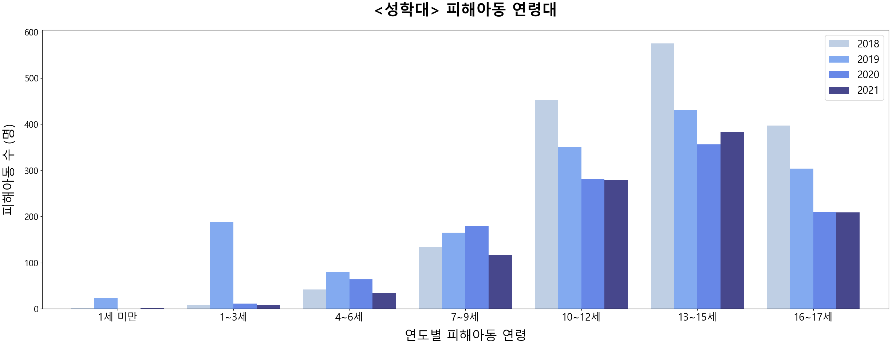

# Project2. Visualization
## 1. 프로젝트명
아동학대 현황 분석 및 아동학대 발생률 감소를 위한 노력

## 2. 프로젝트 선정 배경
미디어에서 아동학대와 관련된 소식이 끊이지 않고 있어 아이들의 인권 보호가 절실히 필요한 시점이라고 생각되어 주제로 선정하게 되었다.

## 3. 수행방법 및 일정
|구분|기간|활동|
|-|-|-|
|사전 기획|8/1 - 8/2|프로젝트 기획 및 주제 선정|
|데이터 선정|8/3 - 8/4|데이터 수집 및 정제|
|시각화|8/7 - 8/11|데이터 시각화|
|데이터 분석|8/14 - 8/15|시각화 기반 데이터 분석|
|포트폴리오 작성|8/16|포트폴리오 작성|
|프로젝트 발표|8/17|프로젝트 발표|

## 4. 프로젝트 개요
### 아동학대란?
보호자를 포함한 성인이 1818세 미만의 미성년자 아이들의 건강이나 복지를 해하거나 제대로 된 성장발달을
못하도록 성적, 신체적 또는 정신적 폭력과 가혹행위가 있을 경우나 자식을 유기하거나 방임하는 경우 (아동복지법 제33조 제77호)

### 아동학대 의심신호
**아래의 내용 중 "한 가지 경우"만 해당되어도 아동학대 의심 신고 가능**  

**<신체적 학대>**
- 사고로 보기에 미심쩍은 상처, 흔적
- 발생, 회복에 시간 차이가 있는 상처나 골절
- 신체 상흔으로 자주 병원을 가는 경우
- 사용된 도구의 모양이 그대로 나타나는 상처

**<정서적 학대>**
- 수면 이상
- 비행, 퇴행 등의 문제 행동
- 신체적 원인이 없는 잦은 통증, 여러 증상의 호소
- 자해 또는 자살 시도

**<성적 학대>**
- 걷거나 앉는 것을 어려워함
- 성기 부위의 통증이나 가려움
- 성기 또는 회음부 손상, 상처
- 성병, 임신

**<방임>**
- 성장지연
- 영양실조, 적절하지 않은 영양 섭취
- 계절에 맞지 않는 옷, 위생관리가 되지 않은 상태
- 지속적인 피로의 호소

## 5. 도출된 인사이트
### 5-1. 시도별 아동학대 의심사례
  
```
2001 - 2021 [21개년 데이터]  
지속적으로 발생해 왔지만 의심사례 신고접수 건수가 13~14 14년도, 16년도 이후 급증하여 "매년 꾸준히 증가하는 추세"임을 확인할 수 있다. 
```

```
아동학대 의심사례가 많이 발생하는 곳은 경기, 서울 지역권임을 알 수 있고, 연도가 지남에 따라 신고 건수가 점차 증가하고 있다.
```

### 5-2. 아동학대 발생 장소

```
- 아동학대 발생장소가 많이 일어나는 장소 상위 2곳은 가정내, 아동 가정 내
- 발생하는 건수는 연도에 따라 증가하고 있으며, 위의 그래프를 통해 아동과 함께 사는 사람에 의해 학대가 일어남을 추측해 볼 수 있다.
```
### 5-3. 아동학대 유형별 현황

```
- 신체학대, 정서학대, 성학대는 남아 여아의 비율에 큰 차이가 없다.
- 성학대의 경우 피해아동이 여아인 경우 약 80% 로 압도적인 수치임을 확인할 수 있다.
```

```
- 성학대의 경우, 비교적 높은 연령대에서 피해아동 발생
- 10~17세 사이의 피해아동이 두드러지게 나타나며, 최근 들어 감소 추세
- 성학대 특성상, 어린 시절부터 지속적으로 피해를 당하는 경우가 많다.
    - 따라서 자신의 의사를 표현할 수 있는 청소년기 때 비교적 늦은 시기에 신고 접수가 이루어짐
```

```
- 4가지 유형 중 3가지 유형 신체학대, 정서학대, 방임은 압도적인 수치로 부모로부터 발생한 피해
    - 즉 아동학대의 주된 가해자는 부모임을 알 수 있다.
- 성학대 유형의 경우, 대리양육자로부터 발생하는 경우가 가장 많았으며 최근 들어 급감하는 형태
    - 하지만 부모, 기타로부터 적지 않은 피해아동이 발생 점점 증가하는 형태
```
### 5-4. 아동학대 학대행위자 고소/고발 결과
 
```
1. 보호처분
- 신체 정서학대 유형은 보호처분으로 처벌 내리는 경우 지속적으로 증가
- 성학대의 경우 보호처분 판결의 건 수가 가장 낮음

2. 형사처벌
- 형사처벌의 경우 보호처분에 비해 압도적으로 낮은 수치
- 성학대의 경우 보호처분 < 형사처벌
- 최근 들어 감소하고 있는 추세
- 형사처벌의 경우에도 3년 이하의 징역이나 금고 또는 500500만원 이하의 벌금형으로 이루어지며, 생각보다 처벌의 수위가 아주 높지 않음

3. 결론  
- 사회문화적 특성 많이 반영
- 가정 내에서 일어나는 범죄에 대한 처벌은 다른 범죄에 비해 비교적 더 많은 아량을 베푸는 것으로 보임
- 이에 대한 원인은 추후에 심층적으로 조사해 볼 필요가 있다고 생각된다
```

### 5-5. 아동학대 요인
#### 5-5-1. 범죄발생 지역


|연도|상관계수|
|-|-|
|2018|0.86333|
|2019|0.83466|
|2020|0.88684|
|2021|0.89879|

```
- 5대 강력범죄인 살인, 강도, 성폭력, 절도, 폭행인 경우로 국한시켜 분석
- 연도별 범죄발생 건수와 아동학대 의심사례는 모두 0.8 이상의 상관계수 값을 가지므로 강한 양의 상관관계임을 알 수 있다.
```

#### 5-5-2. 시/군/구별 고위험 음주율

|연도|상관계수|
|-|-|
|2018|0.85719|
|2019|0.84994|
|2020|0.81777|
|2021|0.78828|
```
연도별 고위험음주 비율과 아동학대 의심사례는 모두 0.7 이상의 상관계수 값을 가지므로 강한 양의 상관관계임을 알 수 있다.
```

#### 5-5-3. 행정구역 시도별 비경제활동인구

|연도|상관계수|
|-|-|
|2018|0.89641|
|2019|0.87684|
|2020|0.91500|
|2021|0.92202|
```
- 앞의 두 가지 요인과 비교했을 때 가장 높은 상관계수 값을 가진다. 
- 연도별 비경제활동인구 수와 아동학대 의심사례는 모두 0.8 이상의 상관계수 값을 가지므로 강한 양의 상관관계임을 알 수 있다.
```
```
위의 세 가지 요인 모두 아동학대 의심사례와 관련하여 최소 0.75 이상의 상관계수 값을 가지므로, 상관성이 매우 높음을 확인할 수 있다.   

추후에 이러한 요인들이 아동학대 발생 여부의 원인이 될 수 있는지 인과관계를 파악해 볼 필요가 있는 것으로 보여진다.
```

## 6. 방향성
### 국가적 차원에서의 노력
**1. 학대 피해 아동 지원을 위한 코디네이터 배치**  
성학대 피해아동은 사건 직후, 치료 또는 피해 보상을 받기 위해 직접 기관을 찾아다니며 필요한 지원 서비스를 신청해야 한다. 분명한 성학대 피해임에도 지원을 받지 못하는 경우 발생하기 때문에 성학대 피해아동의 수사과정부터 지원까지 피해아동을 전담하는 코디네이터를 배치하여 
피해사실을 명확하게 조사해 피해아동에게 수사 관련 정보나 지원정보 제공해야 한다고 생각한다.  
피해아동과 가족을 면접해 필요한 지원기관으로 연계시켜주며, 2차 피해 방지, 지원을 받지 못하는 피해아동이 없도록 도움을 주는 효과를 기대해 볼 수 있다.

**2. 가해자 나이/관계가 아닌 피해 수준에 따른 피해자 보호체계**  
현행 아동복지법은 친족성폭력 가해자가 성인인 경우에만 아동 성학대 피해자로 인정된다. 가해자도 미성년자라면 피해자는 아동 성학대 피해자로 인정되지 않으며, 보건복지부와 지방자치단체 아동학대 전담 공무원의 사례 관리와 회복지원 또한 받지 못한다.  
친족성폭력 가해자가 성인인지 여부에 따라 피해자 보호체계 다르게 작동한다는 한계점이 있으며, 우선적으로 피해아동과 학대행위자를 분리 시킨 후 피해아동이 지낼 수 있는 환경 마련 등 국가에서의 적극적인 인프라 구축이 필요하다고 보여진다.

### 개인적 차원에서의 노력
**1. 피해아동 발견 시 바로 신고하기**  
아동학대에 해당되는 경우를 평소에 인지하고, 만약 유사한 상황을 목격하게 됐다면 바로 신고하도록 한다.  
경찰, 아동보호전문기관, 아동보호담당공무원에게 신고할 수 있으며,
112, 117, 1391 등의 신고전화를 통해 신고할 수 있다.

**2. 부모 교육**  
아동학대의 예방을 목적으로 부모를 대상으로 긍정적 훈육법에 대한 교육이 필요한 것으로 보여진다. 양육과정에서 발생할 수 있는 다양한 사례를 통해 아동학대 유형을 살펴보고, 통계적 수치를 통해 학대행위자, 학대발생장소, 학대행위자 특성 등을 확인하는 시간을 가지는 것이 도움이 될 것이라 생각한다.  
또한 아이들을 체벌시키기보다 올바른 훈육태도를 통해 교육시키도록 하며, 지역 사회가 추구해야 할 아동 인권 보호 인식에 대해 학습해 보는 시간을 주기적으로 가져 경각심을 가지도록 한다.

## 7. 참고자료
4. 프로젝트 개요
- 아동학대 의심신호 : 의협신문 https://www.doctorsnews.co.kr/news/articleView.html?idxno=137701

5. 도출된 인사이트
- 아동학대 발생률에 영향을 미치는 요인: 공공데이터를 활용한 중∙거시적 관점을 중심으로 황유리, 김광혁 전주대학교
    - https://www.kci.go.kr/kciportal/ci/sereArticleSearch/ciSereArtiView.kci?sereArticleSearchBean.artiId=ART002630082

6. 방향성
- 베이비뉴스 https://www.ibabynews.com/news/articleView.html?idxno=64356
- 한겨레신문 https://www.hani.co.kr/arti/society/women/1049582.html